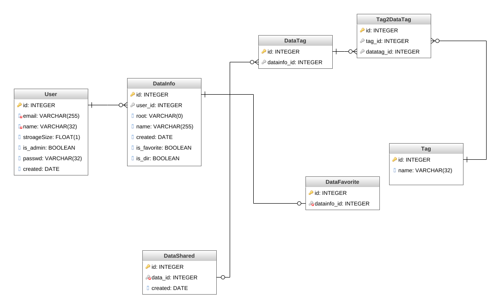
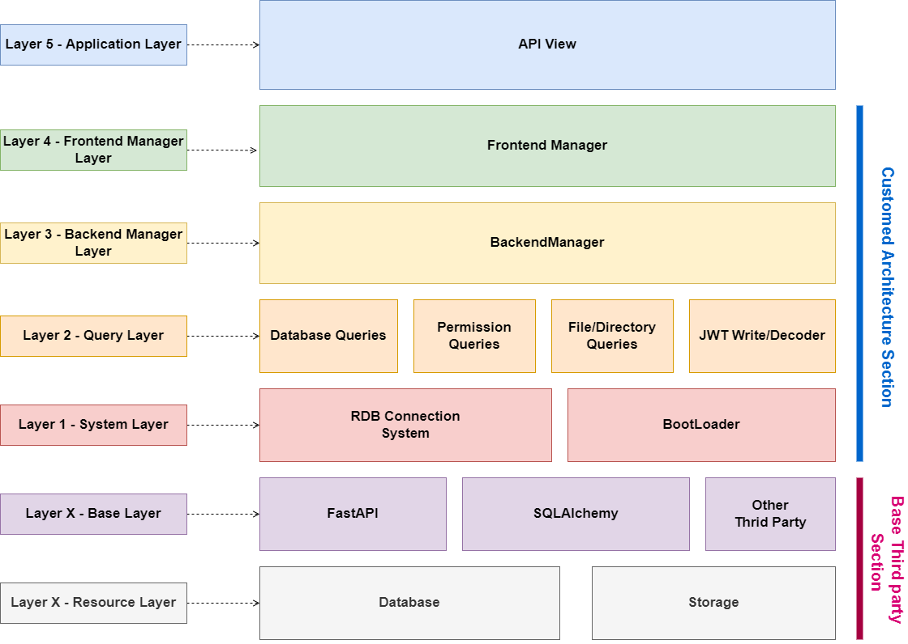
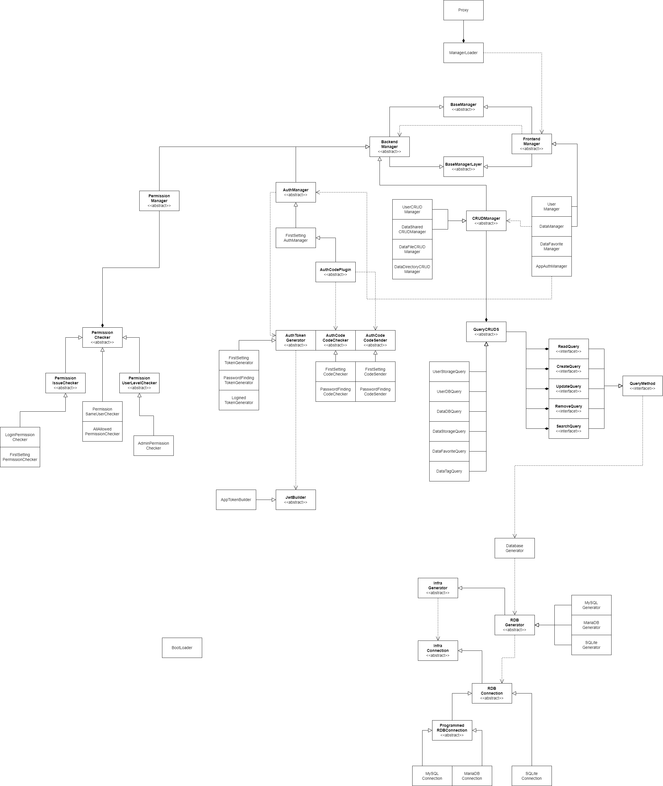

# CloudModular (진행중)

<div align="center">
    
    
    
    
    
    
    
    
    
</div>

<p align="center">
    
</p>

The Constructive Cloud Service for your NAS Server

직접 설치하는 클라우드 서비스

* * *

**개발 현황**

[](https://www.notion.so/CloudModular-ade21e9e1a324cfc916da7d051893717)

**지금 README에 적혀 있는 설명문은 프로잭트 소개용으로 작성되었습니다. 알파 이상의의 버전이 출시되면, 해당 내용은 따로 정적 사이트에 옮기고, 기술스택 및 설치 방법 위주로 작성될 예정입니다.**

## 소개
* 원격 서버 및 NAS Server의 파일 관리 서비스를 지원하기 위해 개발된 설치형 저용량 파일 호스팅 서비스
* 타 서버로부터 금액을 지불하고 일정 용량을 할당 받는 것이 아닌, 개인 서버만 갖고 있으면 이 웹 어플리케이션을 이용해 파일 호스팅 서버를 운용할 수 있습니다.
* PROJECT Microcloudchip의 3번째 작품으로 버전은 2.0입니다.

## 기능
### 사용자 관련 기능
* 기본적인 파일/디렉토리를 관리합니다.
    * 생성/수정/삭제/다운로드/공유
    * 파일/디렉토리에 태그 및 즐겨찾기를 추가해 빠른 데이터 탐색
    * 연관 검색어 기능
* 하나의 서버에 여러 계정 생성 가능
    * 각 계정의 스토리지 용량 직접 설정 가능 (GB 단위)
    * 유저간 파일 복사 가능
* Open-API 직접 구축


## 설치 및 실행 방법(개발자 기준)
해당 어플리케이션은 Unix 환경에서만 작동합니다. Windows를 사용할 경우, WSL2를 미리 설치해 주세요.
### Backend
1. 가상 머신을 생성합니다.
2. repository를 다운받습니다.
3. server 디렉토리로 이동합니다.
4. 아래의 명령어로 패키지들을 설치합니다.
```
$ pip install -r requirments.txt
```
5. .env파일을 생성하고 아래와 같이 작성합니다. sqlite를 사용할 경우, DB_TYPE만 입력합니다.
```
SERVER_PORT=<서버가 돌아갈 포트>
SERVER_HOST=<서버가 돌아갈 호스트(프록시 서버를 사용하지 않을 때 활용)>
SERVER_STORAGE=<서버에 돌아가는 데이터들을 저장할 때 사용>

DB_TYPE=<mysql/mariadb of sqlite>
DB_HOST=<DB Host>
DB_PORT=<DB Port>
DB_DATABASE=<DB Name>
DB_USER=<DB User ID>
DB_PASSWD=<DB User pswd>

ADMIN_EMAIL=<관리자 이메일>
ADMIN_EMAIL_PASSWD=<관리자 2차 이메일 패스워드>

JWT_KEY=<jwt key>
JWT_ALGORITHM=<jwt 알고리즘 (HS256 권장)>
```
6. Model Table을 DB에 추가할 수 있게 마이그레이션을 진행합니다.
```
$ python main.py --method=migrate --type=dev
```
7. 어플리케이션을 실행합니다.
```
$ python main.py --method=run-app --type=dev
```

## 시스템 구성도

### RDB


### 시스템 구성도


### UML

